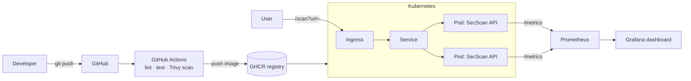

# SecScan

> A security-headers scanner API, wrapped in a **production-style DevOps pipeline** —
> containerization, CI/CD, Kubernetes, monitoring and logging.

[](https://github.com/vladysalvkrutii/secscan/actions/workflows/ci.yml)


The application is deliberately small — it fetches a URL, inspects its security
headers (HSTS, CSP, X-Frame-Options, …) and grades them **A–F**. The point of
this repository is everything *around* the app: how it is built, tested, scanned,
shipped, deployed and observed.

### What this project demonstrates

| DevOps area        | In this repo                                                     |
| ------------------ | ---------------------------------------------------------------- |
| **Containerization** | Multi-stage, non-root Docker image with a healthcheck           |
| **CI/CD**            | GitHub Actions: lint → test → build → Trivy scan → push to GHCR  |
| **Deployment**       | Kubernetes manifests (Deployment, Service, Ingress) + Compose   |
| **Monitoring**       | Prometheus scrapes `/metrics`; Grafana dashboard                |
| **Logging**          | Structured JSON logs to stdout (Loki/ELK ready)                 |
| **Security**         | Trivy image scanning, hardened runtime, Dependabot              |

---

## Architecture



## Tech stack

| Area                | Tooling                                             |
| ------------------- | --------------------------------------------------- |
| Application         | Python 3.12, FastAPI, Uvicorn, httpx                |
| Containerization    | Docker (multi-stage, non-root, healthcheck)         |
| Local orchestration | Docker Compose (api + Prometheus + Grafana)         |
| CI/CD               | GitHub Actions → Ruff, Pytest, Trivy, push to GHCR  |
| Deployment          | Kubernetes (Deployment, Service, Ingress)           |
| Monitoring          | Prometheus (`/metrics`) + Grafana                   |
| Logging             | Structured JSON logs to stdout                      |

---

## Quickstart

### 1. Run the full stack (Docker Compose)

```bash
docker compose up --build -d
```

| Service     | URL                                       |
| ----------- | ----------------------------------------- |
| SecScan API | http://localhost:8000/docs                |
| Prometheus  | http://localhost:9090                     |
| Grafana     | http://localhost:3000 (anonymous admin)   |

Generate some traffic, then watch it on the Grafana **SecScan Overview** dashboard:

```bash
make load        # or: curl "http://localhost:8000/scan?url=https://github.com"
```

### 2. Run locally (Python)

```bash
pip install -r requirements-dev.txt
make test        # ruff + pytest
make run         # uvicorn with autoreload → http://127.0.0.1:8000/docs
```

### 3. Deploy to Kubernetes

```bash
kubectl apply -f k8s/
kubectl get pods -l app=secscan
```

---

## API

| Method | Path       | Description                                 |
| ------ | ---------- | ------------------------------------------- |
| GET    | `/`        | Service metadata                            |
| GET    | `/health`  | Liveness/readiness probe                    |
| GET    | `/scan`    | Scan a URL: `/scan?url=https://github.com`  |
| GET    | `/metrics` | Prometheus metrics                          |

```bash
curl "http://localhost:8000/scan?url=https://github.com"
```

```json
{
  "url": "https://github.com",
  "status_code": 200,
  "score": 90,
  "grade": "A",
  "headers": [
    { "name": "strict-transport-security", "present": true, "value": "max-age=31536000", "advice": null }
  ]
}
```

Example grades from a quick run:

| Site               | Grade | Score |
| ------------------ | ----- | ----- |
| cloudflare.com     | A     | 100   |
| github.com         | A     | 90    |
| example.com        | F     | 0     |

---

## CI/CD pipeline

On every push / pull request (`.github/workflows/ci.yml`):

1. **Lint** — `ruff check`
2. **Test** — `pytest`
3. **Build** — multi-stage Docker image (with layer caching)
4. **Scan** — Trivy reports HIGH/CRITICAL and fails the build on CRITICAL
5. **Push** — image published to **GHCR** as `latest` + commit SHA (on `main`)

## Monitoring & metrics

The API exports Prometheus metrics:

- `secscan_scans_total{grade="A"}` — scans by resulting grade
- `secscan_scan_duration_seconds` — scan latency histogram
- `secscan_scan_errors_total` — failed scans

Prometheus scrapes them and the Grafana dashboard (auto-provisioned) shows total
scans, error rate, scans/sec by grade and p95 latency.

## Security hardening

- Runs as a **non-root** user (uid 10001), no shell
- `readOnlyRootFilesystem`, `allowPrivilegeEscalation: false`, all capabilities dropped
- Minimal `python:3.12-slim` base, multi-stage build (no build tools in final image)
- Trivy image-scanning gate in CI + weekly Dependabot updates
- URL scheme validation to avoid non-HTTP targets

---

## Project structure

```
secscan/
├── app/                  # FastAPI application
│   ├── main.py           # routes, logging, metrics, response models
│   ├── scanner.py        # header fetch + scoring
│   └── metrics.py        # Prometheus metrics
├── tests/                # pytest unit/API tests
├── monitoring/           # Prometheus + Grafana provisioning
├── k8s/                  # Kubernetes manifests
├── .github/workflows/    # CI/CD pipeline
├── Dockerfile            # multi-stage, non-root
├── docker-compose.yml    # api + prometheus + grafana
└── Makefile              # common tasks (make help)
```

## License

MIT — see [LICENSE](LICENSE).
