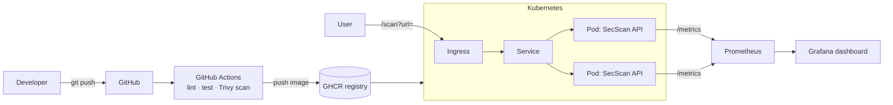

# SecScan

> A small **HTTP security-headers scanner API** wrapped in a complete, production-style DevOps pipeline — containerization, CI/CD, Kubernetes deployment, monitoring and logging.


The application itself is deliberately simple — it fetches a URL, inspects its
security headers (HSTS, CSP, X-Frame-Options, …) and grades them **A–F**. The
point of this repository is everything *around* the app: how it is built,
tested, scanned, shipped, deployed and observed.

---

## Architecture



## Tech stack

| Area               | Tooling                                             |
| ------------------ | --------------------------------------------------- |
| Application        | Python 3.12, FastAPI, Uvicorn, httpx                |
| Containerization   | Docker (multi-stage, non-root, healthcheck)         |
| Local orchestration| Docker Compose (api + Prometheus + Grafana)         |
| CI/CD              | GitHub Actions → Ruff, Pytest, Trivy, push to GHCR  |
| Deployment         | Kubernetes (Deployment, Service, Ingress)           |
| Monitoring         | Prometheus (`/metrics`) + Grafana                   |
| Logging            | Structured JSON logs to stdout (Loki/ELK ready)     |
| Security           | Trivy image scanning, hardened runtime, non-root    |

---

## Quickstart

### 1. Run locally (Python)

```bash
python -m venv .venv && . .venv/Scripts/activate   # Windows
pip install -r requirements-dev.txt
uvicorn app.main:app --reload
# open http://127.0.0.1:8000/docs
```

### 2. Run the full stack (Docker Compose)

```bash
docker compose up --build
```

| Service    | URL                     |
| ---------- | ----------------------- |
| SecScan API| http://localhost:8000/docs |
| Prometheus | http://localhost:9090   |
| Grafana    | http://localhost:3000 (anonymous admin) |

### 3. Deploy to Kubernetes

```bash
kubectl apply -f k8s/
kubectl get pods -l app=secscan
```

---

## API

| Method | Path       | Description                               |
| ------ | ---------- | ----------------------------------------- |
| GET    | `/health`  | Liveness/readiness probe                  |
| GET    | `/scan`    | Scan a URL: `/scan?url=https://github.com`|
| GET    | `/metrics` | Prometheus metrics                        |

Example:

```bash
curl "http://localhost:8000/scan?url=https://github.com"
```

```json
{
  "url": "https://github.com",
  "status_code": 200,
  "score": 90,
  "grade": "A",
  "headers": [
    { "name": "strict-transport-security", "present": true, "value": "max-age=31536000", "advice": null }
  ]
}
```

---

## CI/CD pipeline

On every push / pull request (`.github/workflows/ci.yml`):

1. **Lint** — `ruff check`
2. **Test** — `pytest`
3. **Build** — multi-stage Docker image
4. **Scan** — Trivy fails the build on `CRITICAL`/`HIGH` vulnerabilities
5. **Push** — image published to **GHCR** as `latest` + commit SHA (only on `main`)

## Monitoring & metrics

The API exports Prometheus metrics:

- `secscan_scans_total{grade="A"}` — scans by resulting grade
- `secscan_scan_duration_seconds` — scan latency histogram
- `secscan_scan_errors_total` — failed scans

Prometheus scrapes them and Grafana visualizes them (datasource auto-provisioned).

## Security hardening

- Runs as a **non-root** user (uid 10001), no shell
- `readOnlyRootFilesystem`, `allowPrivilegeEscalation: false`, all capabilities dropped
- Minimal `python:3.12-slim` base, multi-stage build (no build tools in final image)
- Trivy image scanning gate in CI
- URL scheme validation to avoid non-HTTP targets

---

## Project structure

```
secscan/
├── app/                  # FastAPI application
│   ├── main.py           # routes, logging, metrics wiring
│   ├── scanner.py        # header fetch + scoring
│   └── metrics.py        # Prometheus metrics
├── tests/                # pytest unit tests
├── monitoring/           # Prometheus + Grafana provisioning
├── k8s/                  # Kubernetes manifests
├── .github/workflows/    # CI/CD pipeline
├── Dockerfile            # multi-stage, non-root
└── docker-compose.yml    # api + prometheus + grafana
```

## License

MIT
